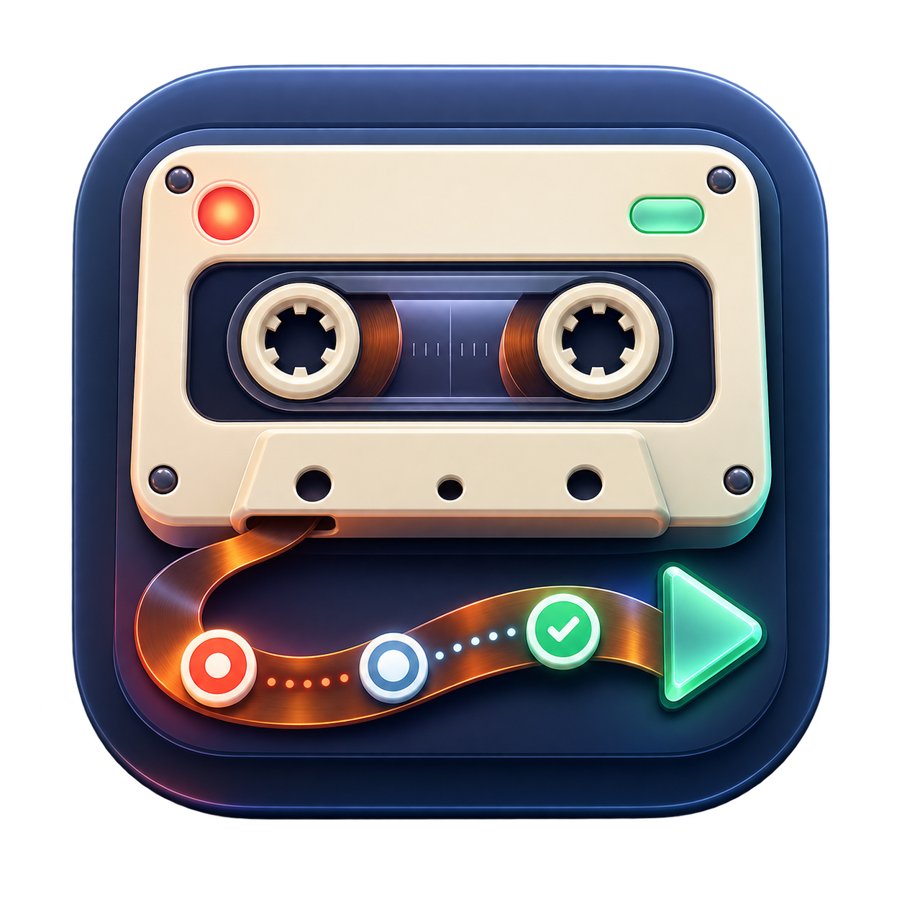
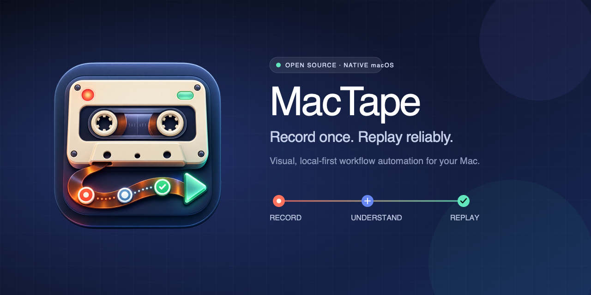
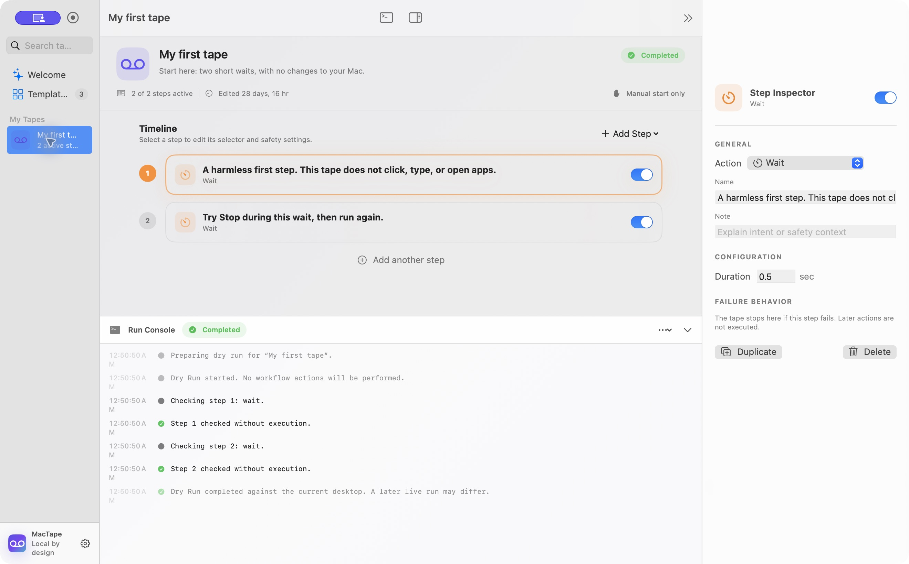

<div align="center">
  
  <h1>MacTape</h1>
  <p><strong>把操作录下来，把流程看明白。</strong></p>
  <p>原生 macOS 可视化工作流录制器 · 本地运行 · MIT 开源</p>
  <p><a href="README.md">English</a> · 简体中文</p>
</div>





MacTape 把你主动录制的点击和快捷键，变成可以阅读、编辑、导出、放进 Git 的步骤。它使用 macOS 辅助功能识别控件，不依赖云端模型，也不把旧的屏幕坐标当成可靠目标。

**这是开发者预览版。** 不承诺支持所有应用，不提供无人值守安全保证。一个普通点击也可能删除、发送或提交数据，运行前必须查看每个步骤。

## 有什么不同

- **可读的录制**：捕获点击和带修饰键的快捷键，不录制日常输入的文字。
- **可检查的目标**：应用标识、控件角色、标题、稳定 ID 和层级提示都保存在工作流里。
- **真正不执行的 Dry Run**：检查当前界面，不点击、不打字、不打开应用、不执行 shell。
- **原生时间线编辑器**：调整顺序、禁用、复制步骤，添加等待、断言、显式文字和变量。
- **遇到不确定就停止**：匹配分数不足或目标模糊时终止，不悄悄跳过。
- **文件属于你**：`.mactape` 是格式化 JSON；提供验证、查看、格式化、列出工作流的 CLI。
- **无运行时第三方依赖**：SwiftUI、AppKit、Accessibility、CoreGraphics；无账户、遥测或订阅。

## 两分钟上手

1. 从 [Releases](https://github.com/jovial-liu/MacTape/releases) 下载，或按下方步骤自行构建。
2. 导入 [`Examples/01-safe-wait.mactape`](Examples/01-safe-wait.mactape)，先试 Dry Run，再试 Run。它只等待 1.5 秒，不修改任何内容。
3. 想录制跨应用操作时，再按提示授予「辅助功能」和「输入监控」权限。不要在敏感应用中做第一次实验。
4. 查看 [TextEdit 示例说明](Examples/README.md)，了解显式文本和变量；该示例不会保存或发送文档。

下载包使用 ad-hoc 签名，**没有 Developer ID 签名或 Apple 公证**。请确认来源和校验和。只有在信任该版本时，参考 [Apple 的逐应用打开说明](https://support.apple.com/en-gb/102445)，不要全局关闭 Gatekeeper。

## 从源码构建

需要 macOS 14+、Swift 6 和 macOS SDK（Xcode 或 Command Line Tools）。

```bash
git clone https://github.com/jovial-liu/MacTape.git
cd MacTape
swift test --build-system native --parallel
Scripts/test-cli.sh
Scripts/run.sh
```

应用位于 `dist/MacTape.app`。构建 Apple silicon + Intel 通用安装包：

```bash
UNIVERSAL=1 Scripts/package-dmg.sh
```

## 使用边界

Dry Run 只能检查**当前**界面，不能预测前一步执行后才出现的窗口。自绘控件、画布、游戏和部分网页可能不暴露可用的辅助功能信息。首版不录制拖拽、滚动和手势。

快捷键和无选择器的文字输入仍依赖应用焦点；匹配分数只是启发式规则，不是成功概率。桌面首版禁止 live shell 步骤，Core API 也只有在明确批准完整命令内容后才能执行。

运行时变量值不进入引擎的运行记录，但手动填写的默认值、窗口标题、标签和导出文件仍可能包含隐私。分享前请检查内容。

## 一起完善

我们最需要真实应用的兼容性反馈、可复现的辅助功能测试、界面改进和选择器修复设计，而不是更多隐藏的自动化权限。

见 [贡献指南](CONTRIBUTING.md)、[架构](docs/ARCHITECTURE.md)、[隐私设计](docs/PRIVACY.md)、[路线图](docs/ROADMAP.md) 和 [MIT 许可证](LICENSE)。
